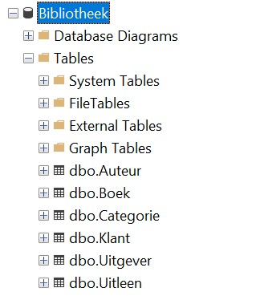

# Hoofdstuk2 - Voorbeeld Databank

Bij deze cursus horen een aantal databases. 
De database waar er in de eerste hoofdstukken mee gaat gewerkt worden is de database **Bibliotheek**.

 
Als we naar de database Bibliotheek kijken, dan zien we dat deze database uit 6 tabellen bestaat:
* Auteur
* Boek
* Categorie
* Klant
* Uitgever
* Uitleen

